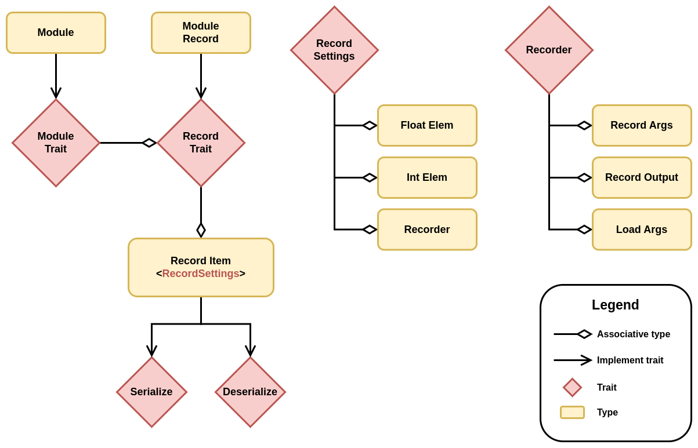

# Architecture

This file documents most major architectural decisions with the reasoning behind them.

__Sections__

* [Module](#module)
  * [Optimization](#optimization)
  * [Serialization](#serialization)
* [Tensor](#tensor)
    * [Backend](#backend)
    * [Autodiff](#autodiff)

## Module

Modules are a way of creating neural network structures that can be easily optimized, saved, and loaded with little to no boilerplate.
Unlike other frameworks, a module does not force the declaration of the forward pass, leaving it up to the implementer to decide how it should be defined.
Additionally, most modules are created using a (de)serializable configuration, which defines the structure of the module and its hyper-parameters.
Parameters and hyper-parameters are not serialized into the same file and both are normally necessary to load a module for inference.

### Optimization

Optimization is normally done with gradient descent (or ascent for reinforcement learning), and it is important to provide an easy API for optimizing modules.

#### Constraints

1. __Users should be able to control what is optimized.__ 
    Modules can contain anything for maximum flexibility, but not everything needs to be optimized.
2. __Optimizers should have a serializable state that is updated during training.__
    Many optimizers keep track of previous gradients to implement some form of momentum.
    However, the state can be anything, not just tensors, allowing for easy implementation of any kind of optimizer.
3. __The learning rate can be updated during training.__
    Learning rate schedulers are often used during training and should be considered as a key aspect.

#### Solution

The solution to this problem comprises multiple parts.
Firstly, the `Optimizer` trait is quite similar to the `Module` trait in terms of saving and loading the state.
Please refer to the [serialization](#serialization) section for more details.

Secondly, two traits were created.
The `Optimizer` trait is general and relatively unopinionated, with a simple `step` method that takes a learning rate, a module, and the gradients.
The other trait, `SimpleOptimizer`, aims to provide an easier API for implementing new optimizers.
The goal is to allow implementations to avoid handling missing gradients, loading and exporting records, navigating the module parameter structure, handling tracked and untracked tensors, and other such tasks.

Thirdly, each tensor that will be optimized needs to be wrapped into a `Param` struct, which gives them an ID used for (de)serialization and to associate the state of the optimizer to each parameter.
The `Module` trait has two ways to navigate over parameters.
The first one is the `map` function, which returns `Self` and makes it easy to implement any transformation and mutate all parameters.
The second one is the `visit` function, which has a similar signature but does not mutate the parameter tensors.

__SimpleOptimizer__

The `SimpleOptimizer` has two major assumptions:

1. The state of the optimizer is linked to each parameter.
In other words, each parameter has its own optimizer state, decoupled from the other parameters.
2. The state of the optimizer implements `Record`, `Clone`, and has a `'static` lifetime.

The benefits of those assumptions materialize in simplicity with little loss in flexibility.
The state associative type is also generic over the dimension, making it extremely easy to include tensors in the state that share the same dimensionality as its parameter.

To wrap a simple optimizer into the more general `Optimizer` trait, the `OptimizerAdaptor` struct is used.

__OptimizerAdaptor__

The `OptimizerAdaptor` is a simple struct composed of a `SimpleOptimizer` and a hashmap with all records associated with each parameter ID.
When performing an optimization step, the adaptor handles the following:

1. Updates each parameter tensor in the given module using the `Module::map` function.
2. Checks if a gradient for the current tensor exists.
3. Makes sure that the gradient, the tensor, and the optimizer state associated with the current parameter are on the same device.
The device can be different if the state is loaded from disk to restart training.
4. Performs the simple optimizer step using the inner tensor since the operations done by the optimizer should not be tracked in the autodiff graph.
5. Updates the state for the current parameter and returns the updated tensor, making sure it's properly registered into the autodiff graph if gradients are marked as required.

Note that a parameter can still be updated by another process, as is the case with running metrics used in batch norm.
These tensors are still wrapped using the `Param` struct so that they are included in the module's state and given a proper parameter ID, but they are not registered in the autodiff graph.

### Serialization

An important aspect of a deep learning framework is the ability to save and load models from disk.
Despite appearing as a simple feature, it involves numerous constraints that require a proper solution.

#### Constraints

1. __Users should be able to declare the precision of the model to be saved, independent of the backend in use.__

    The modules should not be duplicated in RAM in another precision to support this.
    Conversion should be done lazily during (de)serialization.

2. __Users should be able to add any field to a module, even fields that are not serializable.__

    This can include constants, database connections, other module references, or any other information.
    Only parameters should be serialized since the structure of the module itself should be encapsulated with module configurations (hyper-parameters).

3. __Users should be able to declare the format in which the module should be saved.__

    This can involve saving to a compressed JSON file or directly to bytes in memory for `no-std` environments.

4. __Users should be able to create a module with its saved parameters without having to initialize the module first.__

    This will avoid unnecessary module initialization and tensor loading, resulting in reduced cold start when dealing with inference.

In addition to all of these constraints, the solution should be easy to use.

#### Solution

In order to be able to add any field to a module without requiring it to be (de)serializable, we decouple the module type from its state.
We create a new type for each module that only contains the parameters that need to be saved.
To generate that type automatically, the user must either declare which field is a parameter or a constant, or we assume that each field implements the module trait.

The second solution was chosen as it simplifies the code generation and reduces the size of the user API.
This means that the `Module` trait should be implemented by [primitives types](./burn-core/src/module/param/primitive.rs).
The following diagrams highlight the main types and traits used in the solution.

<h4>Module Serialization Types</h4>

The way the types interact with each other is pretty straightforward.
First, a module can be converted into a record using `into_record()`.
Note that tensors can be cloned, but it won't actually copy any data; it will create another reference to the same data.

Then, a `Recorder` instance can be used to serialize any record.
The `Recorder` has the `PrecisionSettings` type as associate type, so any record will be serialized using the settings provided at the creation of the `Recorder` instance.
Note that tensors implement record, and their item is just a wrapper struct that contains information about the precision in which the tensor should be saved or loaded.
No actual copy of the tensor is made until this point.
The tensor is converted to the `Data` struct and then converted into the specified precision only when `serialize()` or `deserialize()` are called, which makes the whole process lazy.

To recapitulate, the `Module` trait has an associated type that implements `Record`, which only contains the parameters of the model.
The `Record` trait has a generic associated type (GAT) that specifies a family of types that can be (de)serialized given any `PrecisionSettings`.
Records are therefore decoupled from the backend in use, and the saved items can be loaded on any backend with any precision, since the conversion is type-safe and done when `serialize()` and `deserialize()` are called.
All of the types are generated using simple derive macros without any conditional statements or complex syntax, as `Record` and `Module` are implemented for all primitive types.
This makes the code simple and easy to maintain.
In addition, you can extend the current system with your own `Recorder` and `PrecisionSettings` to control how your modules should be saved and loaded.

##### Pros

* All constraints are respected.
* The code is simple and easy to maintain, with very few conditional statements.
It is just recursive data structures, where all the complexity is handled by the framework in primitive implementations.
* The user API is simple and small, with only two derives (`Record` and `Module`) and no additional attributes.
* Users can create their own `Module` and `Record` primitive types, which gives them the flexibility to control how their data is serialized without having to fork the framework.

##### Cons

* There are more types, but most of them are automatically generated and single-purpose, so users don't need to interact with them for common use cases.
However, they can do so if necessary.
* When instantiating a new record manually, each field must be set to something, even if the type itself is `()`, which represents no value.
Since the code generation step uses associative types, it doesn't know that a field type is actually nothing.
Creating a record manually without using the generated function `into_record` or loading it from a file is only useful to load a set of parameters into a module from an arbitrary source.
Using the record may not be the optimal solution to this problem, and another API could be created in the future.

##### Compatibility

Record may become incompatible with previous versions of Burn, depending on the chosen format.
The more compact format (bincode) store minimal information about the type, making it significantly smaller but less resilient to type changes such adding an optional field.
At some point, it might be necessary to provide a translation script that can translate a more resilient format from a previous version to a more compact one.

### Tensor

A proper deep learning framework should have a fast tensor implementation with autodiff support, and Burn is no exception.
The tensor API abstracts away backend implementation details and focuses on usability without compromising performance.
To make it as easy as possible to use, there is only one tensor type, which is different from multiple tensor and deep learning crates in Rust.
Generic parameters are used instead to specialize the tensor type.

* __B: Backend:__
The first argument is the backend on which the tensor implementation lies.
* __const D: usize:__
The second argument is the dimensionality of the tensor.
* __K: TensorKind:__
The third argument is the tensor kind, which can be either Float, Int or Bool.
By default, the tensor kind is set to Float, so for most tensors, the kind argument is not necessary.

Having one struct for tensors reduces the complexity of the tensor API, which also means less duplicated documentation to write and maintain.

Tensors are thread-safe, which means that you can send a tensor to another thread, and everything will work, including auto-differentiation.
Note that there are no in-place tensor operations since all tensor operations take owned tensors as parameters, which make it possible to mutate them.
Tensors can be shared simply by cloning them, but if there is only one reference to a tensor, the backend implementation is free to reuse the tensor's allocated data.
For more information about how it is done, you can have a look at this [blog post](https://burn-rs.github.io/blog/burn-rusty-approach-to-tensor-handling).

#### Backend

The Backend trait abstracts multiple things:

* Device type
* Float tensor type
* Bool tensor type
* Int tensor type
* Float element type
* Int element type
* Float tensor operations (kernels)
* Int tensor operations (kernels)
* Bool tensor operations (kernels)

Even though having one type for tensors is convenient for the tensor API, it can be cumbersome when implementing a backend.
Therefore, backends can decide, through associated types, what types they want to use for their int, float, and bool tensors.
Since float and int can have multiple precisions, the float and int element types are also associated types that must be declared by the backend.

Note that the backend chooses the precision and not the user.
Since not all backends will support the same element types, no assumptions must be made.
Therefore, there are no methods on tensors to change the precision, except for the `to_full_precision` function, which ensures numerical stability on the current backend.
Backend implementations can provide a way to choose the precision, which can be accomplished with a generic parameter (e.g. `NdArrayBackend<f32>`).

To be as general as possible, tensor operations are implemented as plain functions.
There is no object or self, just functions that take tensors as input and often return tensors as output as well.
Backend implementations are free to use their own patterns to implement these kernels.
Note that Burn is a dynamic graph deep learning framework, so backends may have to implement asynchronous kernel executions for performance reasons.

#### Autodiff

As of now, there is only one backend decorator that supports autodiff.
It follows the decorator pattern, making any backend differentiable.
However, the `ADBackend` trait abstracts how gradients are calculated, and other approaches to autodiff might be added later.
For more information about how the current autodiff backend works, you can read this [blog post](https://burn-rs.github.io/blog/burn-rusty-approach-to-tensor-handling).
