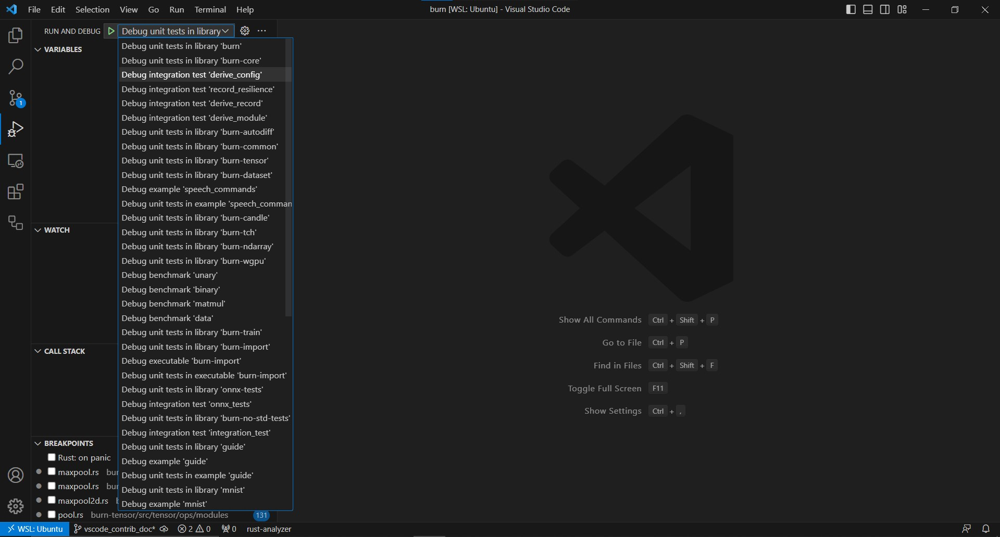

# Contributing to the Burn Project

Welcome to the Burn project! We're thrilled that you're considering contributing to our project.
Every contribution helps, and we're delighted to have you on board.

## How to Contribute?

Here are some steps to guide you through the process of contributing to the Burn project:

### Step 1: Review the Issue Tickets

Before you start working on a contribution, please take a moment to look through the open issues in
the [issue tracker](https://github.com/tracel-ai/burn/issues) for this project. This will give you an
idea of what kind of work is currently being planned or is in progress.

### Step 2: Get Familiar with the Project Architecture

It's crucial to have an understanding of the [project's architecture](https://github.com/tracel-ai/burn/tree/main/contributor-book/src/project-architecture). Familiarize
yourself with the structure of the project, the purpose of different components, and how they
interact with each other. This will give you the context needed to make meaningful contributions.

### Step 3: Fork and Clone the Repository

Before you can start making changes, you'll need to fork the Burn repository and clone it to your
local machine. This can be done via the GitHub website or the GitHub Desktop application. Here are
the steps:

1. Click the "Fork" button at the top-right of this page to create a copy of this project in your
   GitHub account.
2. Clone the repository to your local machine. You can do this by clicking the "Code" button on the
   GitHub website and copying the URL. Then open a terminal on your local machine and type
   `git clone [the URL you copied]`.

### Step 4: Create a New Branch

It's a good practice to create a new branch for each contribution you make. This keeps your changes
organized and separated from the main project, which can make the process of reviewing and merging
your changes easier. You can create a new branch by using the command
`git checkout -b [branch-name]`.

### Step 5: Make Your Changes

Once you have set up your local repository and created a new branch, you can start making changes.
Be sure to follow the coding standards and guidelines used in the rest of the project.

### Step 6: Validate code before opening a Pull Request

Before you open a pull request, please run [`./run-checks.sh all`](/run-checks.sh). This
will ensure that your changes are in line with our project's standards and guidelines. You can run
this script by opening a terminal, navigating to your local project directory, and typing
`./run-checks`.

Note that under the hood `run-checks` runs the `cargo xtask validate` command which is powered by
the [tracel-xtask crate](https://github.com/tracel-ai/xtask). It is recommended to get familiar with
it as it provides a wide variety of commands to help you work with the code base.

If you have an error related to `torch` installation, see [Burn Torch Backend Installation](./crates/burn-tch/README.md#Installation)

Format and lint errors can often be fixed automatically using the command `cargo xtask fix all`.

### Step 7: Submit a Pull Request

After you've made your changes and run the pre-pull request script, you're ready to submit a pull
request. This can be done through the GitHub website or the
[GitHub Desktop application](https://desktop.github.com/).

When submitting your pull request, please provide a brief description of the changes you've made and
the issue or issues that your changes address.

### Optional step for VS Code: Setting up environment

1. Install the following extensions:

- [rust-lang.rust-analyzer](https://marketplace.visualstudio.com/items?itemName=rust-lang.rust-analyzer)
- [tamasfe.even-better-toml](https://marketplace.visualstudio.com/items?itemName=tamasfe.even-better-toml)
- [serayuzgur.crates](https://marketplace.visualstudio.com/items?itemName=serayuzgur.crates)
- [vadimcn.vscode-lldb](https://marketplace.visualstudio.com/items?itemName=vadimcn.vscode-lldb)

2. Open `Command Palette` with Ctrl+Shift+P or F1 and type `LLDB: Generate Launch Configurations from Cargo.toml` then select it, this will generate a file that should be saved as `.vscode/launch.json`.
You may also want to enable debugging by creating a `.vscode/settings.json` file:
   ```json
   {
   "rust-analyzer.runnables.extraEnv": {
      "CARGO_PROFILE_DEV_DEBUG": true
   }
   }
   ```
   since this repo has `debug = 0` in the root `Cargo.toml` to speed up compilation.

3. Now you can enable breakpoint on code through IDE and then start debugging the library/binary you want, such as the following example:

<div align="center">

<div align="left">

4. If you're creating a new library or binary, keep in mind to repeat the step 2 to always keep a fresh list of targets.

## Code Guidelines

We believe in clean and efficient code. While we don't enforce strict coding guidelines, we trust
and use tools like `cargo fmt` and `cargo clippy` to maintain code quality. These are integrated
into our `run-checks` script, ensuring consistency across our codebase.

### Writing Expect Messages

In Rust, the `expect()` function is a crucial tool for handling errors. However, the power of
`expect()` lies in its ability to convey clear, actionable messages. When you use `expect()`, your
message should describe the successful outcome of the function rather than focusing on the error.

Here's a helpful tip from the [Rust documentation](https://doc.rust-lang.org/std/result/enum.Result.html#recommended-message-style):

_Think of `expect()` messages as guidelines for future you and other developers. Frame them with the word “should” like “The ENV variable should be set by X function” or “The binary should be accessible and executable by the current user.”_

This approach ensures that `expect()` messages are informative and aligned with the intended
function outcomes, making debugging and maintenance more straightforward for everyone.

## Others

To bump for the next version, install `cargo-edit` if its not on your system, and use this command:

```
cargo set-version --bump minor
```

---

We look forward to seeing your contributions to the Burn project. Happy coding!

If you have any questions and would like to get in touch with us, please feel free to join our
discord server:
[](https://discord.gg/uPEBbYYDB6)
