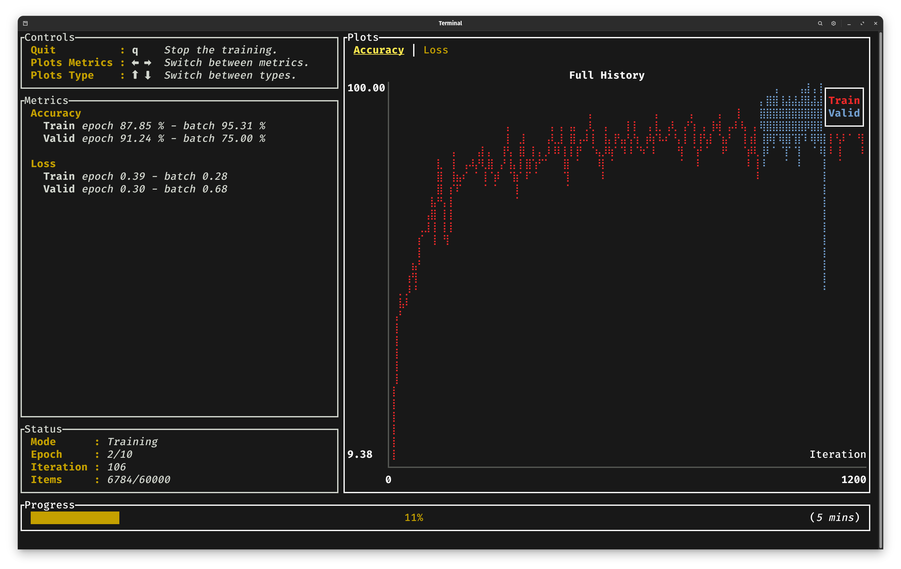

# Backend

We have effectively written most of the necessary code for training our model. However, we have not
explicitly designated the backend to be used at any point. Indeed, only the `main` function remains.

```rust , ignore
use burn::optim::AdamConfig;
use burn::backend::{WgpuBackend, wgpu::AutoGraphicsApi};
use burn::autodiff::ADBackendDecorator;
use guide::model::ModelConfig;

fn main() {
    type MyBackend = WgpuBackend<AutoGraphicsApi, f32, i32>;
    type MyAutodiffBackend = ADBackendDecorator<MyBackend>;

    let device = burn_wgpu::WgpuDevice::default();
    guide::training::train::<MyAutodiffBackend>(
        "/tmp/guide",
        guide::training::TrainingConfig::new(ModelConfig::new(10, 512), AdamConfig::new()),
        device,
    );
}
```

In this example, we use the `WgpuBackend` which is compatible with any operating system and will use
the GPU. For other options, see the Burn README. This backend type takes the graphics api, the float
type and the int type as generic arguments that will be used during the training. By leaving the
graphics API as `AutoGraphicsApi`, it should automatically use an API available on your machine. The
autodiff backend is simply the same backend, wrapped within the `ADBackendDecorator` struct which
imparts differentiability to any backend.

We call the `train` function defined earlier with a directory for artifacts, the configuration of
the model (the number of digit classes is 10 and the hidden dimension is 512), the optimizer
configuration which in our case will be the default Adam configuration, and the device which can be
obtained from the backend.

When running the example, we can see the training progression through a basic CLI dashboard:


