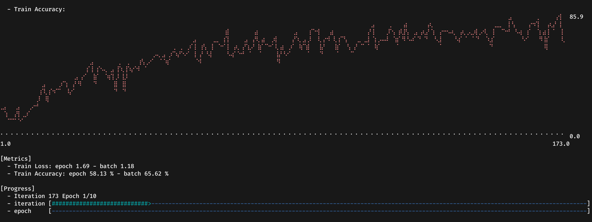

# Backend

We have effectively written most of the necessary code to train our model. However, we have not
explicitly designated the backend to be used at any point. This will be defined in the main
entrypoint of our program, namely the `main` function defined in `src/main.rs`.

Burn's default Cargo features do not include an execution backend. Applications select
one explicitly, for example WGPU:

```toml
burn = { version = "0.22.0-pre.3", features = ["wgpu"] }
```

```rust , ignore
# mod data;
# mod model;
# mod training;
#
use crate::{model::ModelConfig, training::TrainingConfig};
use burn::{
    prelude::*,
#     data::dataset::Dataset,
    optim::AdamConfig,
};

fn main() {
    // Create a default Wgpu-backed device.
    let device = Device::wgpu(Default::default());

    // All the training artifacts will be saved in this directory
    let artifact_dir = "target/guide";
    crate::training::train(
        artifact_dir,
        TrainingConfig::new(ModelConfig::new(10, 512), AdamConfig::new()),
        device.clone(),
    );
}
```

In this code snippet, we select a WGPU device, which is compatible with any operating system and
uses the GPU. For other options, see the Burn README. The model itself remains backend-agnostic:
tensor operations are dispatched according to their device. The training function creates an
autodiff-enabled device internally.

We call the `train` function defined earlier with a directory for artifacts, the configuration of
the model (the number of digit classes is 10 and the hidden dimension is 512), the optimizer
configuration which in our case will be the default Adam configuration, and the device which can be
obtained from the backend.

You can now train your freshly created model with the command:

```console
cargo run --release
```

When running your project with the command above, you should see the training progression through a
basic CLI dashboard:


