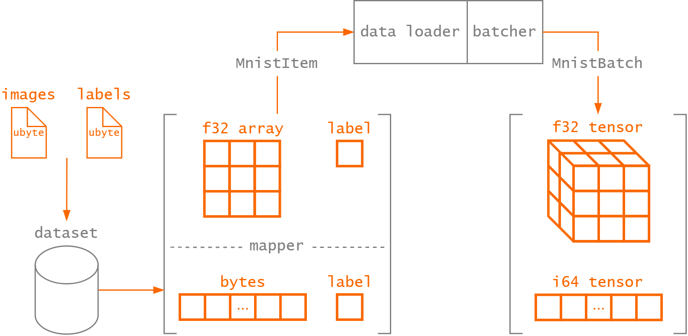

# Dataset

At its core, a dataset is a collection of data typically related to a specific analysis or
processing task. The data modality can vary depending on the task, but most datasets primarily
consist of images, texts, audio or videos.

This data source represents an integral part of machine learning to successfully train a model.
Thus, it is essential to provide a convenient and performant API to handle your data. Since this
process varies wildly from one problem to another, it is defined as a trait that should be
implemented on your type. The dataset trait is quite similar to the dataset abstract class in
PyTorch:

```rust, ignore
pub trait Dataset<I>: Send + Sync {
    fn get(&self, index: usize) -> Option<I>;
    fn len(&self) -> usize;
}
```

The dataset trait assumes a fixed-length set of items that can be randomly accessed in constant
time. This is a major difference from datasets that use Apache Arrow underneath to improve streaming
performance. Datasets in Burn don't assume _how_ they are going to be accessed; it's just a
collection of items.

However, you can compose multiple dataset transformations to lazily obtain what you want with zero
pre-processing, so that your training can start instantly!

## Transformation

Transformations in Burn are all lazy and modify one or multiple input datasets. The goal of these
transformations is to provide you with the necessary tools so that you can model complex data
distributions.

| Transformation     | Description                                                                                                              |
| ------------------ | ------------------------------------------------------------------------------------------------------------------------ |
| `SamplerDataset`   | Samples items from a dataset. This is a convenient way to model a dataset as a probability distribution of a fixed size. |
| `SelectionDataset` | Selects a subset of items by index from a dataset. Can be randomly shuffled; can be re-shuffled.                         |
| `ShuffledDataset`  | Shuffles a wrapped dataset; This is a thin wrapper around `SelectionDataset`.                                            |
| `PartialDataset`   | Returns a view of the input dataset with a specified range.                                                              |
| `MapperDataset`    | Computes a transformation lazily on the input dataset.                                                                   |
| `ComposedDataset`  | Composes multiple datasets together to create a larger one without copying any data.                                     |
| `WindowsDataset`   | Dataset designed to work with overlapping windows of data extracted from an input dataset.                               |

Let us look at the basic usages of each dataset transform and how they can be composed together.
These transforms are lazy by default except when specified, reducing the need for unnecessary
intermediate allocations and improving performance. The full documentation of each transform can be
found at the [API reference](https://burn.dev/docs/burn/data/dataset/transform/index.html).

- **SamplerDataset**: This transform can be used to sample items from a dataset with (default) or
  without replacement. Transform is initialized with a sampling size which can be bigger or smaller
  than the input dataset size. This is particularly useful in cases where we want to checkpoint
  larger datasets more often during training and smaller datasets less often as the size of an epoch
  is now controlled by the sampling size. Sample usage:

```rust, ignore
type DbPedia = SqliteDataset<DbPediaItem>;
let dataset: DbPedia = HuggingfaceDatasetLoader::new("dbpedia_14")
        .dataset("train").
        .unwrap();

let dataset = SamplerDataset<DbPedia, DbPediaItem>::new(dataset, 10000);
```

- **SelectionDataset**: This transform can be used to select a subset of items from a dataset by
  index. It can be initialized with a list of indices to select from the input dataset. This is
  particularly useful when you want to create a smaller dataset from a larger one, for example, to
  create a validation set from a training set.

  The `SelectionDataset` can also be initialized with a random seed to shuffle the indices before
  selection. This is useful when you want to randomly select a subset of items from the dataset.

  Base dataset items may be included more than once in the selection.

```rust, ignore
let explicit = SelectionDataset::from_indices_checked(dataset.clone(), vec![0, 1, 2, 0]);

let shuffled = SelectionDataset::new_shuffled(dataset.clone(), &mut rng);
let shuffled = SelectionDataset::new_shuffled(dataset.clone(), 42);

let mut mutable = SelectionDataset::new_select_all(dataset.clone(), vec![0, 1, 2, 0]);
mutable.shuffle(42);
mutable.shuffle(&mut rng);
```

- **ShuffledDataset**: This transform can be used to shuffle the items of a dataset. Particularly
  useful before splitting the raw dataset into train/test splits. Can be initialized with a seed to
  ensure reproducibility.

  The `ShuffledDataset` is a thin wrapper around the `SelectionDataset`.

```rust, ignore
let dataset = ShuffledDataset<DbPedia, DbPediaItem>::new(dataset, &mut rng);
let dataset = ShuffledDataset<DbPedia, DbPediaItem>::new(dataset, 42);
```

- **PartialDataset**: This transform is useful to return a view of the dataset with specified start
  and end indices. Used to create train/val/test splits. In the example below, we show how to chain
  ShuffledDataset and PartialDataset to create splits.

```rust, ignore
// define chained dataset type here for brevity
type PartialData = PartialDataset<ShuffledDataset<DbPedia, DbPediaItem>>;
let len = dataset.len();
let split = "train"; // or "val"/"test"

let data_split = match split {
    "train" => PartialData::new(dataset, 0, len * 8 / 10),  // Get first 80% dataset
    "test" => PartialData::new(dataset, len * 8 / 10, len), // Take remaining 20%
    _ => panic!("Invalid split type"),                      // Handle unexpected split types
};
```

- **MapperDataset**: This transform is useful to apply a transformation on each of the items of a
  dataset. Particularly useful for normalization of image data when channel means are known.

- **ComposedDataset**: This transform is useful to compose multiple datasets downloaded from
  multiple sources (say different HuggingfaceDatasetLoader sources) into a single bigger dataset
  which can be sampled from one source.

- **WindowsDataset**: This transform is useful to create overlapping windows of a dataset.
  Particularly useful for sequential Time series Data, for example when working with an LSTM.

## Storage

There are multiple dataset storage options available for you to choose from. The choice of the
dataset to use should be based on the dataset's size as well as its intended purpose.

| Storage            | Description                                                                                                                                          |
| ------------------ | ---------------------------------------------------------------------------------------------------------------------------------------------------- |
| `InMemDataset`     | In-memory dataset that uses a vector to store items. Well-suited for smaller datasets.                                                               |
| `SqliteDataset`    | Dataset that uses [SQLite](https://www.sqlite.org/) to index items that can be saved in a simple SQL database file. Well-suited for larger datasets. |
| `DataframeDataset` | Dataset that uses [Polars](https://www.pola.rs/) dataframe to store and manage data. Well-suited for efficient data manipulation and analysis.       |

## Sources

For now, there are only a couple of dataset sources available with Burn, but more to come!

### Hugging Face

You can easily import any Hugging Face dataset with Burn. We use SQLite as the storage to avoid
downloading the model each time or starting a Python process. You need to know the format of each
item in the dataset beforehand. Here's an example with the
[dbpedia dataset](https://huggingface.co/datasets/dbpedia_14).

```rust, ignore
#[derive(Clone, Debug, serde::Serialize, serde::Deserialize)]
pub struct DbPediaItem {
    pub title: String,
    pub content: String,
    pub label: usize,
}

fn main() {
    let dataset: SqliteDataset<DbPediaItem> = HuggingfaceDatasetLoader::new("dbpedia_14")
        .dataset("train") // The training split.
        .unwrap();
}
```

We see that items must derive `serde::Serialize`, `serde::Deserialize`, `Clone`, and `Debug`, but
those are the only requirements.

<div class="warning">

The `HuggingfaceDatasetLoader` relies on the
[`datasets` library by HuggingFace](https://huggingface.co/docs/datasets/index) to download
datasets. This is a Python library, so you must have an existing Python installation to use this
loader.

</div>

### Images

`ImageFolderDataset` is a generic vision dataset used to load images from disk. It is currently
available for multi-class and multi-label classification tasks as well as semantic segmentation and
object detection tasks.

```rust, ignore
// Create an image classification dataset from the root folder,
// where images for each class are stored in their respective folder.
//
// For example:
// root/dog/dog1.png
// root/dog/dog2.png
// ...
// root/cat/cat1.png
let dataset = ImageFolderDataset::new_classification("path/to/dataset/root").unwrap();
```

```rust, ignore
// Create a multi-label image classification dataset from a list of items,
// where each item is a tuple `(image path, labels)`, and a list of classes
// in the dataset.
//
// For example:
let items = vec![
    ("root/dog/dog1.png", vec!["animal".to_string(), "dog".to_string()]),
    ("root/cat/cat1.png", vec!["animal".to_string(), "cat".to_string()]),
];
let dataset = ImageFolderDataset::new_multilabel_classification_with_items(
    items,
    &["animal", "cat", "dog"],
)
.unwrap();
```

```rust, ignore
// Create a segmentation mask dataset from a list of items, where each
// item is a tuple `(image path, mask path)` and a list of classes
// corresponding to the integer values in the mask.
let items = vec![
    (
        "path/to/images/image0.png",
        "path/to/annotations/mask0.png",
    ),
    (
        "path/to/images/image1.png",
        "path/to/annotations/mask1.png",
    ),
    (
        "path/to/images/image2.png",
        "path/to/annotations/mask2.png",
    ),
];
let dataset = ImageFolderDataset::new_segmentation_with_items(
    items,
    &[
        "cat", // 0
        "dog", // 1
        "background", // 2
    ],
)
.unwrap();
```

```rust, ignore
// Create an object detection dataset from a COCO dataset. Currently only
// the import of object detection data (bounding boxes) is supported.
//
// COCO offers separate annotation and image archives for training and
// validation, paths to the unpacked files need to be passed as parameters:

let dataset = ImageFolderDataset::new_coco_detection(
    "/path/to/coco/instances_train2017.json",
    "/path/to/coco/images/train2017"
)
.unwrap();

```

### Comma-Separated Values (CSV)

Loading records from a simple CSV file in-memory is simple with the `InMemDataset`:

```rust, ignore
// Build dataset from csv with tab ('\t') delimiter.
// The reader can be configured for your particular file.
let mut rdr = csv::ReaderBuilder::new();
let rdr = rdr.delimiter(b'\t');

let dataset = InMemDataset::from_csv("path/to/csv", rdr).unwrap();
```

Note that this requires the `csv` crate.

**What about streaming datasets?**

There is no streaming dataset API with Burn, and this is by design! The learner struct will iterate
multiple times over the dataset and only checkpoint when done. You can consider the length of the
dataset as the number of iterations before performing checkpointing and running the validation.
There is nothing stopping you from returning different items even when called with the same `index`
multiple times.

## How Is The Dataset Used?

During training, the dataset is used to access the data samples and, for most use cases in
supervised learning, their corresponding ground-truth labels. Remember that the `Dataset` trait
implementation is responsible to retrieve the data from its source, usually some sort of data
storage. At this point, the dataset could be naively iterated over to provide the model a single
sample to process at a time, but this is not very efficient.

Instead, we collect multiple samples that the model can process as a _batch_ to fully leverage
modern hardware (e.g., GPUs - which have impressing parallel processing capabilities). Since each
data sample in the dataset can be collected independently, the data loading is typically done in
parallel to further speed things up. In this case, we parallelize the data loading using a
multi-threaded `BatchDataLoader` to obtain a sequence of items from the `Dataset` implementation.
Finally, the sequence of items is combined into a batched tensor that can be used as input to a
model with the `Batcher` trait implementation. Other tensor operations can be performed during this
step to prepare the batch data, as is done [in the basic workflow guide](../basic-workflow/data.md).
The process is illustrated in the figure below for the MNIST dataset.



Although we have conveniently implemented the
[`MnistDataset`](https://github.com/tracel-ai/burn/blob/main/crates/burn-dataset/src/vision/mnist.rs)
used in the guide, we'll go over its implementation to demonstrate how the `Dataset` and `Batcher`
traits are used.

The [MNIST dataset](http://yann.lecun.com/exdb/mnist/) of handwritten digits has a training set of
60,000 examples and a test set of 10,000 examples. A single item in the dataset is represented by a
\\(28 \times 28\\) pixels black-and-white image (stored as raw bytes) with its corresponding label
(a digit between \\(0\\) and \\(9\\)). This is defined by the `MnistItemRaw` struct.

```rust, ignore
# #[derive(Deserialize, Debug, Clone)]
struct MnistItemRaw {
    pub image_bytes: Vec<u8>,
    pub label: u8,
}
```

With single-channel images of such low resolution, the entire training and test sets can be loaded
in memory at once. Therefore, we leverage the already existing `InMemDataset` to retrieve the raw
images and labels data. At this point, the image data is still just a bunch of bytes, but we want to
retrieve the _structured_ image data in its intended form. For that, we can define a `MapperDataset`
that transforms the raw image bytes to a 2D array image (which we convert to float while we're at
it).

```rust, ignore
const WIDTH: usize = 28;
const HEIGHT: usize = 28;

# /// MNIST item.
# #[derive(Deserialize, Serialize, Debug, Clone)]
pub struct MnistItem {
    /// Image as a 2D array of floats.
    pub image: [[f32; WIDTH]; HEIGHT],

    /// Label of the image.
    pub label: u8,
}

struct BytesToImage;

impl Mapper<MnistItemRaw, MnistItem> for BytesToImage {
    /// Convert a raw MNIST item (image bytes) to a MNIST item (2D array image).
    fn map(&self, item: &MnistItemRaw) -> MnistItem {
        // Ensure the image dimensions are correct.
        debug_assert_eq!(item.image_bytes.len(), WIDTH * HEIGHT);

        // Convert the image to a 2D array of floats.
        let mut image_array = [[0f32; WIDTH]; HEIGHT];
        for (i, pixel) in item.image_bytes.iter().enumerate() {
            let x = i % WIDTH;
            let y = i / HEIGHT;
            image_array[y][x] = *pixel as f32;
        }

        MnistItem {
            image: image_array,
            label: item.label,
        }
    }
}

type MappedDataset = MapperDataset<InMemDataset<MnistItemRaw>, BytesToImage, MnistItemRaw>;

# /// The MNIST dataset consists of 70,000 28x28 black-and-white images in 10 classes (one for each digits), with 7,000
# /// images per class. There are 60,000 training images and 10,000 test images.
# ///
# /// The data is downloaded from the web from the [CVDF mirror](https://github.com/cvdfoundation/mnist).
pub struct MnistDataset {
    dataset: MappedDataset,
}
```

To construct the `MnistDataset`, the data source must be parsed into the expected `MappedDataset`
type. Since both the train and test sets use the same file format, we can separate the functionality
to load the `train()` and `test()` dataset.

```rust, ignore

impl MnistDataset {
    /// Creates a new train dataset.
    pub fn train() -> Self {
        Self::new("train")
    }

    /// Creates a new test dataset.
    pub fn test() -> Self {
        Self::new("test")
    }

    fn new(split: &str) -> Self {
        // Download dataset
        let root = MnistDataset::download(split);

        // Parse data as vector of images bytes and vector of labels
        let images: Vec<Vec<u8>> = MnistDataset::read_images(&root, split);
        let labels: Vec<u8> = MnistDataset::read_labels(&root, split);

        // Collect as vector of MnistItemRaw
        let items: Vec<_> = images
            .into_iter()
            .zip(labels)
            .map(|(image_bytes, label)| MnistItemRaw { image_bytes, label })
            .collect();

        // Create the MapperDataset for InMemDataset<MnistItemRaw> to transform
        // items (MnistItemRaw -> MnistItem)
        let dataset = InMemDataset::new(items);
        let dataset = MapperDataset::new(dataset, BytesToImage);

        Self { dataset }
    }

#    /// Download the MNIST dataset files from the web.
#    /// Panics if the download cannot be completed or the content of the file cannot be written to disk.
#    fn download(split: &str) -> PathBuf {
#        // Dataset files are stored un the burn-dataset cache directory
#        let cache_dir = dirs::home_dir()
#            .expect("Could not get home directory")
#            .join(".cache")
#            .join("burn-dataset");
#        let split_dir = cache_dir.join("mnist").join(split);
#
#        if !split_dir.exists() {
#            create_dir_all(&split_dir).expect("Failed to create base directory");
#        }
#
#        // Download split files
#        match split {
#            "train" => {
#                MnistDataset::download_file(TRAIN_IMAGES, &split_dir);
#                MnistDataset::download_file(TRAIN_LABELS, &split_dir);
#            }
#            "test" => {
#                MnistDataset::download_file(TEST_IMAGES, &split_dir);
#                MnistDataset::download_file(TEST_LABELS, &split_dir);
#            }
#            _ => panic!("Invalid split specified {}", split),
#        };
#
#        split_dir
#    }
#
#    /// Download a file from the MNIST dataset URL to the destination directory.
#    /// File download progress is reported with the help of a [progress bar](indicatif).
#    fn download_file<P: AsRef<Path>>(name: &str, dest_dir: &P) -> PathBuf {
#        // Output file name
#        let file_name = dest_dir.as_ref().join(name);
#
#        if !file_name.exists() {
#            // Download gzip file
#            let bytes = download_file_as_bytes(&format!("{URL}{name}.gz"), name);
#
#            // Create file to write the downloaded content to
#            let mut output_file = File::create(&file_name).unwrap();
#
#            // Decode gzip file content and write to disk
#            let mut gz_buffer = GzDecoder::new(&bytes[..]);
#            std::io::copy(&mut gz_buffer, &mut output_file).unwrap();
#        }
#
#        file_name
#    }
#
#    /// Read images at the provided path for the specified split.
#    /// Each image is a vector of bytes.
#    fn read_images<P: AsRef<Path>>(root: &P, split: &str) -> Vec<Vec<u8>> {
#        let file_name = if split == "train" {
#            TRAIN_IMAGES
#        } else {
#            TEST_IMAGES
#        };
#        let file_name = root.as_ref().join(file_name);
#
#        // Read number of images from 16-byte header metadata
#        let mut f = File::open(file_name).unwrap();
#        let mut buf = [0u8; 4];
#        let _ = f.seek(SeekFrom::Start(4)).unwrap();
#        f.read_exact(&mut buf)
#            .expect("Should be able to read image file header");
#        let size = u32::from_be_bytes(buf);
#
#        let mut buf_images: Vec<u8> = vec![0u8; WIDTH * HEIGHT * (size as usize)];
#        let _ = f.seek(SeekFrom::Start(16)).unwrap();
#        f.read_exact(&mut buf_images)
#            .expect("Should be able to read image file header");
#
#        buf_images
#            .chunks(WIDTH * HEIGHT)
#            .map(|chunk| chunk.to_vec())
#            .collect()
#    }
#
#    /// Read labels at the provided path for the specified split.
#    fn read_labels<P: AsRef<Path>>(root: &P, split: &str) -> Vec<u8> {
#        let file_name = if split == "train" {
#            TRAIN_LABELS
#        } else {
#            TEST_LABELS
#        };
#        let file_name = root.as_ref().join(file_name);
#
#        // Read number of labels from 8-byte header metadata
#        let mut f = File::open(file_name).unwrap();
#        let mut buf = [0u8; 4];
#        let _ = f.seek(SeekFrom::Start(4)).unwrap();
#        f.read_exact(&mut buf)
#            .expect("Should be able to read label file header");
#        let size = u32::from_be_bytes(buf);
#
#        let mut buf_labels: Vec<u8> = vec![0u8; size as usize];
#        let _ = f.seek(SeekFrom::Start(8)).unwrap();
#        f.read_exact(&mut buf_labels)
#            .expect("Should be able to read labels from file");
#
#        buf_labels
#    }
}
```

Since the `MnistDataset` simply wraps a `MapperDataset` instance with `InMemDataset`, we can easily
implement the `Dataset` trait.

```rust, ignore
impl Dataset<MnistItem> for MnistDataset {
    fn get(&self, index: usize) -> Option<MnistItem> {
        self.dataset.get(index)
    }

    fn len(&self) -> usize {
        self.dataset.len()
    }
}
```

The only thing missing now is the `Batcher`, which we already went over
[in the basic workflow guide](../basic-workflow/data.md). The `Batcher` takes a list of `MnistItem`
retrieved by the dataloader as input and returns a batch of images as a 3D tensor along with their
targets.
