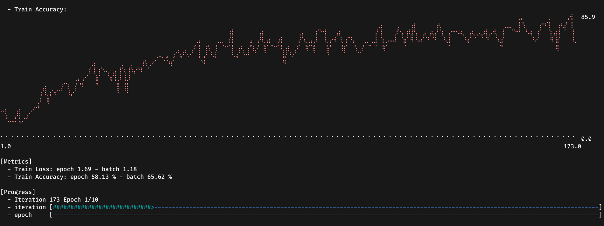

# Backend

So we have coded everything to train our model, but didn't specify at anyplace the backend to be used.
The last remaing thing to code is the main function.

```rust, ignore
use burn::optim::AdamConfig;
use guide::model::ModelConfig;

fn main() {
    type MyBackend = burn_wgpu::WgpuBackend<burn_wgpu::AutoGraphicsApi, f32, i32>;
    type MyAutodiffBackend = burn_autodiff::ADBackendDecorator<MyBackend>;

    let device = burn_wgpu::WgpuDevice::default();
    guide::training::train::<MyAutodiffBackend>(
        "/tmp/guide",
        guide::training::TrainingConfig::new(ModelConfig::new(10, 512), AdamConfig::new()),
        device,
    );
}
```

In this example, we will use the `WgpuBackend` which is compatible with any operating system and will use the GPU.
The backend takes the graphics api, the float type and the int type as generic argument that will be used during the training.
The autodiff backend is simply the backend wrapped with the `ADBackendDecorator` which makes any backend diffirentiable.
We call the function with the default adam configuration, specifying that the number of classes (10) and the hidden dimension (512).
When running the example, we can see the training progression through a basic CLI dashboard.


