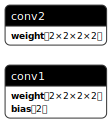
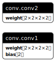

# PyTorch Model

## Introduction

Whether you've trained your model in PyTorch or you want to use a pre-trained model from PyTorch,
you can import them into Burn. Burn supports importing PyTorch model weights with `.pt` file
extension. Compared to ONNX models, `.pt` files only contain the weights of the model, so you will
need to reconstruct the model architecture in Burn.

## How to export a PyTorch model

If you have a PyTorch model that you want to import into Burn, you will need to export it first,
unless you are using a pre-trained published model. To export a PyTorch model, you can use the
`torch.save` function.

Here is an example of how to export a PyTorch model:

```python
import torch
import torch.nn as nn

class Net(nn.Module):
    def __init__(self):
        super(Net, self).__init__()
        self.conv1 = nn.Conv2d(2, 2, (2,2))
        self.conv2 = nn.Conv2d(2, 2, (2,2), bias=False)

    def forward(self, x):
        x = self.conv1(x)
        x = self.conv2(x)
        return x

if __name__ == "__main__":
    torch.manual_seed(42)  # To make it reproducible
    model = Net().to(torch.device("cpu"))
    model_weights = model.state_dict()
    torch.save(model_weights, "conv2d.pt")
```

Use [Netron](https://github.com/lutzroeder/netron) to view the exported model. You should see
something like this:



## How to import a PyTorch model

1. Define the model in Burn:

   ```rust
   use burn::{
       nn::conv::{Conv2d, Conv2dConfig},
       prelude::*,
   };

   #[derive(Module, Debug)]
   pub struct Net<B: Backend> {
       conv1: Conv2d<B>,
       conv2: Conv2d<B>,
   }

   impl<B: Backend> Net<B> {
       /// Create a new model from the given record.
       pub fn new_with(record: NetRecord<B>) -> Self {
           let conv1 = Conv2dConfig::new([2, 2], [2, 2])
               .init_with(record.conv1);
           let conv2 = Conv2dConfig::new([2, 2], [2, 2])
               .with_bias(false)
               .init_with(record.conv2);
           Self { conv1, conv2 }
       }

       /// Forward pass of the model.
       pub fn forward(&self, x: Tensor<B, 4>) -> Tensor<B, 4> {
           let x = self.conv1.forward(x);
           self.conv2.forward(x)
       }
   }
   ```

2. Load the model weights from the exported PyTorch model (2 options):

   a) _Dynamically_, but this requires burn-import runtime dependency:

   ```rust
   use crate::model;

   use burn::record::{FullPrecisionSettings, Recorder};
   use burn_import::pytorch::PyTorchFileRecorder;

   type Backend = burn_ndarray::NdArray<f32>;

   fn main() {
       let device = Default::default();
       let record = PyTorchFileRecorder::<FullPrecisionSettings>::default()
           .load("./conv2d.pt".into(), &device)
           .expect("Should decode state successfully");

       let model = model::Net::<Backend>::new_with(record);
   }
   ```

   b) _Pre-converted_ to Burn's binary format:

   ```rust
   // Convert the PyTorch model to Burn's binary format in
   // build.rs or in a separate executable. Then, include the generated file
   // in your project. See `examples/pytorch-import` for an example.

   use crate::model;

   use burn::record::{FullPrecisionSettings, NamedMpkFileRecorder, Recorder};
   use burn_import::pytorch::PyTorchFileRecorder;

   type Backend = burn_ndarray::NdArray<f32>;

   fn main() {
       let device = Default::default();
       let recorder = PyTorchFileRecorder::<FullPrecisionSettings>::default()
       let record: model::NetRecord<B> = recorder
           .load("./conv2d.pt".into(), &device)
           .expect("Should decode state successfully");

       // Save the model record to a file.
       let recorder = NamedMpkFileRecorder::<FullPrecisionSettings>::default();
       recorder
           .record(record, "MY_FILE_OUTPUT_PATH".into())
           .expect("Failed to save model record");
   }

   /// Load the model from the file in your source code (not in build.rs or script).
   fn load_model() -> Net::<Backend> {
       let device = Default::default();
       let record = NamedMpkFileRecorder::<FullPrecisionSettings>::default()
           .load("./MY_FILE_OUTPUT_PATH".into(), &device)
           .expect("Should decode state successfully");

       Net::<Backend>::new_with(record)
   }
   ```

## Extract Configuration

In some cases, models may require additional configuration settings, which are often included in a
`.pt` file during export. The `config_from_file` function from the `burn-import` cargo package
allows for the extraction of these configurations directly from the `.pt` file. The extracted
configuration can then be used to initialize the model in Burn. Here is an example of how to extract
the configuration from a `.pt` file:

```rust
use std::collections::HashMap;

use burn::config::Config;
use burn_import::pytorch::config_from_file;

#[derive(Debug, Config)]
struct NetConfig {
    n_head: usize,
    n_layer: usize,
    d_model: usize,
    // Candle's pickle has a bug with float serialization
    // https://github.com/huggingface/candle/issues/1729
    // some_float: f64,
    some_int: i32,
    some_bool: bool,
    some_str: String,
    some_list_int: Vec<i32>,
    some_list_str: Vec<String>,
    // Candle's pickle has a bug with float serialization
    // https://github.com/huggingface/candle/issues/1729
    // some_list_float: Vec<f64>,
    some_dict: HashMap<String, String>,
}

fn main() {
    let path = "weights_with_config.pt";
    let top_level_key = Some("my_config");
    let config: NetConfig = config_from_file(path, top_level_key).unwrap();
    println!("{:#?}", config);

    // After extracting, it's recommended you save it as a json file.
    config.save("my_config.json").unwrap();
}
```

## Troubleshooting

### Adjusting the source model architecture

If your target model differs structurally from the model you exported, `PyTorchFileRecorder` allows
changing the attribute names and the order of the attributes. For example, if you exported a model
with the following structure:

```python
class ConvModule(nn.Module):
    def __init__(self):
        super(ConvModule, self).__init__()
        self.conv1 = nn.Conv2d(2, 2, (2,2))
        self.conv2 = nn.Conv2d(2, 2, (2,2), bias=False)

    def forward(self, x):
        x = self.conv1(x)
        x = self.conv2(x)
        return x

class Net(nn.Module):
    def __init__(self):
        super(Net, self).__init__()
        self.conv = ConvModule()

    def forward(self, x):
        x = self.conv(x)
        return x
```

But you need to import it into a model with the following structure:

```rust
#[derive(Module, Debug)]
pub struct Net<B: Backend> {
    conv1: Conv2d<B>,
    conv2: Conv2d<B>,
}
```

Which produces the following weights structure (viewed in
[Netron](https://github.com/lutzroeder/netron)):



You can use the `PyTorchFileRecorder` to change the attribute names and the order of the attributes
by specifying a regular expression (See
[regex::Regex::replace](https://docs.rs/regex/latest/regex/struct.Regex.html#method.replace) and
[try it online](https://rregex.dev/?version=1.10&method=replace)) to
match the attribute name and a replacement string in `LoadArgs`:

```rust
let device = Default::default();
let load_args = LoadArgs::new("tests/key_remap/key_remap.pt".into())
    // Remove "conv" prefix, e.g. "conv.conv1" -> "conv1"
    .with_key_remap("conv\\.(.*)", "$1");

let record = PyTorchFileRecorder::<FullPrecisionSettings>::default()
    .load(load_args, &device)
    .expect("Should decode state successfully");

let model = Net::<Backend>::new_with(record);
```

### Loading the model weights to a partial model

`PyTorchFileRecorder` enables selective weight loading into partial models. For instance, in a model
with both an encoder and a decoder, it's possible to load only the encoder weights. This is done by
defining the encoder in Burn, allowing the loading of its weights while excluding the decoder's.

### Specifying the top-level key for state_dict

Sometimes the [`state_dict`](https://pytorch.org/tutorials/beginner/saving_loading_models.html#what-is-a-state-dict)
is nested under a top-level key along with other metadata as in a
[general checkpoint](https://pytorch.org/tutorials/beginner/saving_loading_models.html#saving-loading-a-general-checkpoint-for-inference-and-or-resuming-training).
For example, the `state_dict` of the whisper model is nested under `model_state_dict` key.
In this case, you can specify the top-level key in `LoadArgs`:

```rust
let device = Default::default();
let load_args = LoadArgs::new("tiny.en.pt".into())
    .with_top_level_key("my_state_dict");

let record = PyTorchFileRecorder::<FullPrecisionSettings>::default()
    .load(load_args, &device)
    .expect("Should decode state successfully")
```

## Current known issues

1. [Candle's pickle does not currently unpack boolean tensors](https://github.com/tracel-ai/burn/issues/1179).
